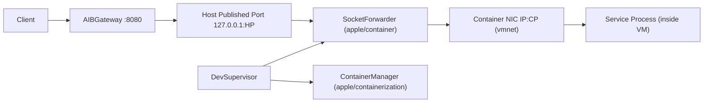

# AgentsInBlack Container Runtime Final Design (Non-Phased)

Status: Target Architecture (single final state)

## 1. Goal

この設計は、AIB のローカル実行基盤を **ワークアラウンドなし** で成立させる最終形を定義する。

- `apple/containerization` を VM/コンテナ実行境界の基盤として使う
- `apple/container` の **ライブラリ部分のみ** を host ingress/publish の基盤として使う
- AIB 独自の guest 内 TCP-UDS ブリッジ実装を廃止する
- Gateway/Health/Runtime の経路を 1 つに統一し、readiness の不整合をなくす

### 1.1 Non-Install Requirement

この最終設計は、利用者に `container` CLI/daemon の手動インストールを要求しない。

- `container` は SwiftPM dependency としてアプリに同梱してビルドする
- 利用するのは publish/forwarding に必要なライブラリ API のみ
- `container system start` 等の外部常駐プロセスを前提にしない

## 2. Root Cause of Past Failures

### 2.1 Container IP direct access が失敗した理由

`ContainerManager.VmnetNetwork` は vmnet shared network 上で container 側 IP を割り当てるが、
ホストからの inbound 到達性は常に保証されない。
そのため、`host -> containerIP:PORT` を readiness/gateway で直接使う構成は不安定になる。

### 2.2 UDS ブリッジが動いた理由と限界

`guest UDS -> host UDS` relay は host 到達性を強制できるため一時的に安定した。
ただし本質的には以下の問題を持つ。

- runtime ごとの bridge script 管理が必要
- `AIB_BRIDGE_COMMAND` など AIB 独自契約が増える
- container runtime の責務とアプリ責務が混在する

## 3. Final Architecture

最終形では、service の ingress は必ず host published port を経由する。

- Gateway Data Plane: `Client -> Gateway -> 127.0.0.1:publishedPort`
- Health Probe Plane: `Supervisor -> 127.0.0.1:publishedPort`
- Container Plane: `ContainerManager + VmnetNetwork`
- Publish Plane: `SocketForwarder.TCPForwarder`

## 4. Component Responsibilities

## 4.1 AIBSupervisor (Control Plane)

- service 起動順序を管理
- container 作成/開始/停止を管理
- host published port を割当
- readiness/liveness を published endpoint に対して実行
- routing snapshot を Gateway に反映

## 4.2 Container Runtime Adapter (containerization)

- `ContainerManager` と `LinuxContainer` のライフサイクル管理
- container internal port (`containerPort`) への `PORT` 注入
- image/rootfs/kernel の準備
- VM 終了監視

## 4.3 Host Publish Adapter (container)

- `PublishPort` を runtime 入力モデルとして採用
- `TCPForwarder` を起動して `hostPort -> containerIP:containerPort` を確立
- service stop 時に forwarder を確実に close/wait

補足:

- ここで使うのは `SocketForwarder` などのライブラリ部品のみ
- `ContainerAPIClient` や `container-apiserver` は本設計の必須要件ではない

## 4.4 AIBGateway (Data Plane)

- backend endpoint は TCP のみ (`127.0.0.1:hostPort`)
- UDS transport 分岐を持たない
- Host header は backend authority (`127.0.0.1:hostPort`) を明示設定

## 5. Runtime Contract

## 5.1 Port Model

- `containerPort`: サービスプロセスが VM 内で listen するポート
- `hostPort`: Supervisor がホストで確保する公開ポート
- backend endpoint: 常に `127.0.0.1:hostPort`

`containerPort` と `hostPort` は同値である必要はない。

## 5.2 Process Contract

- サービスは `PORT` を受けて `0.0.0.0:$PORT` で待受する
- graceful shutdown は `SIGTERM` で行う
- bridge script の存在を前提にしない

## 5.3 Config Contract (workspace.yaml)

v1 互換を維持しつつ、内部モデルを次に統一する。

- `service.port` は **containerPort の意図値**
- `hostPort` は Supervisor がランタイム時に割当
- route には `hostPort` を反映

## 6. Sequence

## 6.1 Startup

1. Supervisor が `hostPort` を確保
2. ContainerManager で container 作成（env `PORT=containerPort`）
3. container 起動し `containerIP` を取得
4. `PublishPort(host=127.0.0.1, hostPort, containerPort, tcp)` を生成
5. `TCPForwarder` を起動
6. readiness probe を `http://127.0.0.1:hostPort` へ実施
7. ready 後に Gateway route を ready 化

## 6.2 Shutdown

1. route を draining/unavailable 化
2. container に graceful stop
3. forwarder close/wait
4. container delete/release
5. `hostPort` を allocator に返却

## 7. Required Code Changes (Final-State Requirements)

次を最終形の必須変更として定義する。

- `EntrypointGenerator` から runtime bridge 生成を削除
- `AIB_BRIDGE_COMMAND` の注入を削除
- `BackendEndpoint.unixSocketPath` と `transport == .unixSocket` 分岐を削除
- `HTTPConnectionHandler` の UDS 前提 Host 分岐を削除
- health probe の `http+unix` URL 経路を削除
- container stop 時の UDS artifact cleanup を削除

## 8. Observability and Errors

必須ログ項目を統一する。

- `service_id`
- `container_id`
- `container_ip`
- `container_port`
- `host_port`
- `forwarder_state` (`starting|ready|closed|failed`)
- `readiness_target`

readiness timeout 時は次を明示する。

- `probe_url`
- `last_error`
- `forwarder_state`
- `container_running` (bool)

## 9. Design Invariants

- ingress は必ず host published port を経由する
- Gateway と Health は同一 endpoint を使う
- AIB は guest bridge script を持たない
- source of truth は引き続き workspace `.aib/workspace.yaml`
- Control Plane と Data Plane の責務を混在させない

## 10. Acceptance Criteria

- 全 service が bridge script なしで readiness 到達する
- `agent/node` と `swift-browse` の同時起動で readiness timeout が再発しない
- `aib emulator start` が連続再起動でも stale socket を残さない
- `AIBGatewayTests` と `AIBSupervisorTests` が TCP-only endpoint で green
